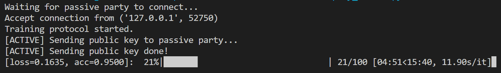
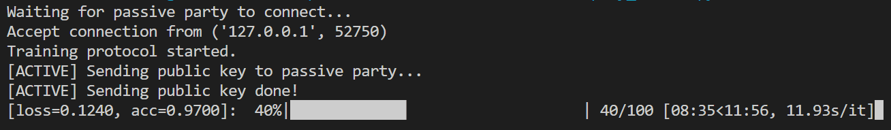
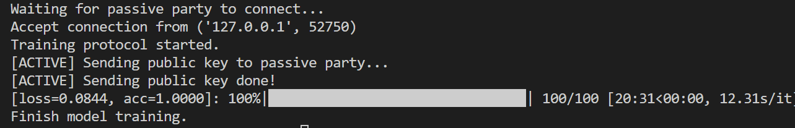

<!-- title: Your Title -->
# 实验二 隐私保护的机器学习
<div align=right>PB21061224 付斯珂</div>

***
## 1. 代码相关内容
- **y_hat 计算流程：** 根据论文中的公式，`active_wx`对应$\Theta^Ax^A$，其中$\Theta^A$为A方模型的参数，$x^A$为A方模型的数据。类似地`passive_wx`对应$\Theta^Bx^B$。`full_wx`对应 $\Theta x = \Theta^Ax^A + \Theta^Bx^B$。`y_hat`对应$\^y = h_{\Theta}x$
    ```python
    # Q1. Active party calculates y_hat
    active_wx = np.dot(self.x_train[batch_idxes], self.params)  # TODO
    passive_wx = self.messenger.recv()
    full_wx = active_wx + passive_wx  # TODO
    y_hat = self.activation(full_wx)
    ```
    ```python
    # Q1. Calculate wx and send it to active party
    passive_wx = np.dot(self.x_train[batch_idxes], self.params)  # TODO
    self.messenger.send(passive_wx)
    ```

- **梯度计算流程：** 
active：对residue ($y-\^y$) 同态加密后发送给passive方，接收到加密后的passive方gradient后解密，得到passive_grad，并发给passive方。
    ```python
    # Q2. Active party helps passive party to calculate gradient
    enc_residue = self.cryptosystem.encrypt_vector(residue)  # TODO
    enc_residue = np.array(enc_residue)
    self.messenger.send(enc_residue)
    enc_passive_grad = self.messenger.recv()
    passive_grad = self.cryptosystem.decrypt_vector(enc_passive_grad)  # TODO
    self.messenger.send(passive_grad)
    ```
    passive：利用接收到的加密后的residue计算自己的加密的gradient，再加上一个加密的随机数发送给active方。收到解密的自己的gradient和随机数之和后，减去随机数得到gradient。
    ```python
    # Q2. Receive encrypted residue and calculate masked encrypted gradients
    enc_residue = self.messenger.recv()
    enc_grad = self._gradient(enc_residue, batch_idxes)
    enc_mask_grad, mask = self._mask_grad(enc_grad)
    self.messenger.send(enc_mask_grad)
    # Receive decrypted masked gradient and update model
    mask_grad = self.messenger.recv()
    true_grad = self._unmask_grad(mask_grad, mask)
    ```

- **模型准确率计算流程：**
输出y_hat每一维的概率值大于等于阈值0.5，预测为正类，记为1；小于阈值0.5则预测为负类，记为0。最后计算预测结果与真实标签之间的一致性（acc）：y_hat和y_true相等的维度占所有维度的比例。
    ```python
    def _acc(self, y_true, y_hat):
        # Q3. Compute accuracy
        binary_predictions = np.where(y_hat >= 0.5, 1, 0)
        acc = np.mean(binary_predictions == y_true)  # TODO
        
        return acc
    ```

## 2. 文字描述内容
**Q1 . 请说明代码中 scale 函数的原理及作用：play_active.py: line 13, play_passive.py: line 13**
```
def scale(dataset):
    raw_dataset = dataset.get_dataset()

    start_col = 2 if dataset.has_label else 1
    scaled_feats = preprocessing.scale(raw_dataset[:, start_col:], copy=False)
    raw_dataset[:, start_col:] = scaled_feats

    dataset.set_dataset(raw_dataset)
```
`raw_dataset = dataset.get_dataset() `从 dataset 对象中获取原始数据集。
`start_col` 是一个变量，用于确定要进行特征缩放的起始列的索引。如果 dataset 中有标签（即监督学习问题），则起始列为 2；否则为 1。
`scaled_feats = preprocessing.scale(raw_dataset[:, start_col:], copy=False)` 使用 preprocessing.scale 函数对所有数据的从 start_col 开始的特征进行缩放。copy=False 表示在原地修改原始数据而不创建副本。
`raw_dataset[:, start_col:] = scaled_feats` 将缩放后的特征赋值回原始数据集的相应位置。
`dataset.set_dataset(raw_dataset)` 将更新后的原始数据集重新设置到 dataset 对象中。

play_active.py和play_passive.py在训练模型前使用scale函数的目的是将数据集中的特征进行标准化或缩放，以确保它们具有相似的尺度，可以避免某些特征的数值范围过大对模型造成偏差或影响。

**Q2 . 当前代码在每个 epoch 开始时使用 epoch 值作为随机数种子，请说明含义，并实现另一种方式以达到相同的目的**
```python
for epoch in tbar:
    all_idxes = np.arange(n_samples)
    np.random.seed(epoch)
    np.random.shuffle(all_idxes)
```
`all_idxes = np.arange(n_samples)`将all_idxes赋值为0到n_samples的数组（在cancer-active-train.csv和cancer-passive-train.csv中n_samples = 455）。
`np.random.seed(epoch)`在每个 epoch 开始时使用 epoch 值作为随机数种子，是为了确保每个epoch `np.random.shuffle(all_idxes)`打乱all_idxes的方式都不同，那么每个epoch训练的数据顺序不同。可以增加样本多样性、提高模型的泛化能力，并帮助优化算法更好地搜索全局最小值，从而改善模型的训练效果。
**另一种方式：** 将np.random.seed()参数设置为空
```python
for epoch in tbar:
    np.random.seed()
    all_idxes = np.arange(n_samples)
    np.random.shuffle(all_idxes)
```
如果不设置np.random.seed()的值，则系统根据时间来自己选择这个值，此时每次生成的随机数因时间差异而不同。
也可另写程序验证：
<figure>


</figure>

**Q3 . 试分析 VFL-LR 训练流程中潜在的隐私泄露风险，并简要说明可能的保护方式**
**active 方的 label 数据泄露：** 训练模型的某一步active方将$\frac{\partial L}{\partial \Theta_B} + R_B$传送给passive方，passive方从中可以获取其 grandients。而 gradients 是残差 $y_i-\^y_i$ 的线性组合。若passive方有n个实例，m个特征，就可以得到m个关于n个残差的线性组合。当$m\geq n$时，可以从该组线性等式中得到残差。
当passive方得到残差$y_i-\^y_i,\  i\in D_A$，因为$y_i\in \{0,1\}$，$\^y_i \in (0,1)$，若残差为负，说明 $y_i = 0$；若残差为正，说明 $y_i = 1$。passive方就可以学习到 label $y_i,\ i\in D_A$，active 方的 label 数据发生隐私泄露。
**passive方的 feature 数据泄露：** passive方记为B，active方记为A。B某一步将$\Theta^B x^B_i, \ i\in D_B$发送给A，A从中可以构造出n个关于$\Theta^B ,\ x^B_i, \ i\in D_B$的等式，其中有$(n+1) \times m$个未知量。若这一步被重复，A可以得到另外n个等式，同时也会得到m个新的未知量，因为模型参数$\Theta_B$每轮迭代后被改变。若这一步在训练中被重复了 $r$ 轮，A总共得到了$n\times r$个等式，其中有$(n+r)\times m$个未知量。当$n>m$且$r\geq \frac{nm}{n-m}$时，未知量可以被A解出。passive方的私有数据泄露。
**active 方的 feature 数据泄露：** 由上述分析知在某些情况下B可以学习到A的残差$y_i-\^y_i$，进而学习到$y_i,\ i \in D_A$，进一步学习到$\^y_i,\ i \in D_A$，然后学习到$\Theta^A x^A_i,\ i \in D_A$，和之前对passive方的分析类似可得，在某些情况下active 方的 feature 数据泄露。

**可能的保护方式：** 考虑n样本数、m特征数、r迭代次数之间的关系，设定这些参数的值，使得上述隐私泄露成立的条件不被满足。

## 3. 实验结果说明
同时运行play_active和play_passive
进度条代表已经完成的epoch数。每次训练完一个batch显示loss和acc，每个epoch 5个batch，loss和acc更新5次后进度加1%。

play_active端








play_passive端

